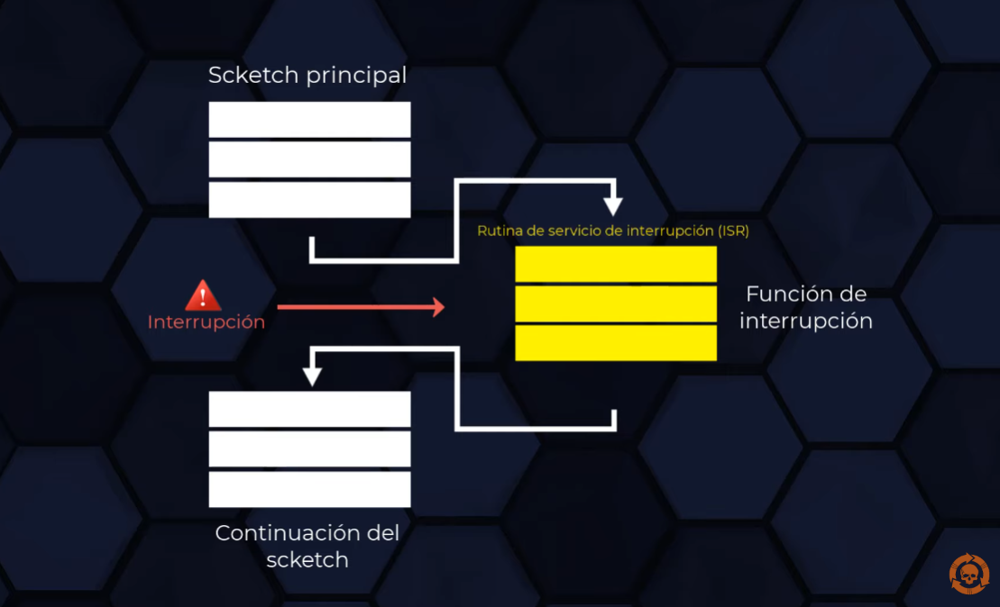

# INTERRUPCIONES EXTERNAS ESP32 - DEVKIT V1

**Las interrupciones nos permiten reaccionar a eventos externos a la placa de una forma rápida.
 Cuando se detecta una señal, una interrupción, interrumpe el proceso que se está ejecutando.**

## Funciones Arduino IDE:

| Función | Descripción |
| ------------- | ------------- |
| attachInterrupt(GPIOPin, ISR, Mode); | Asocia una interrupción con un pin seleccionado. 
| detachInterrupt(GPIOPin); | Desasocia una interrupción existente 

https://youtu.be/crVZC4YcakQ
