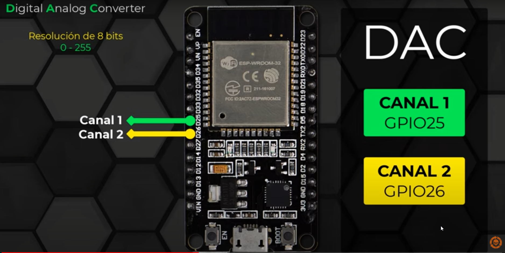

# SALIDAS ANALÓGICAS ESP32 - DEVKIT V1

**Este tipo de salidas nos permiten controlar la cantidad de energia que entregamos a una carga,
y nos servirá por ejemplo para controlar la intensidad luminosa de una lampara, la velocidad de giro de motores o incluso para reproducir sonidos.**

## Funciones Arduino IDE:

| Función | Descripción |
| ------------- | ------------- |
| dacWrite(canal, voltaje) | Establece un voltaje en el canal seleccionado. 

https://youtu.be/L-mB_w24xIk

