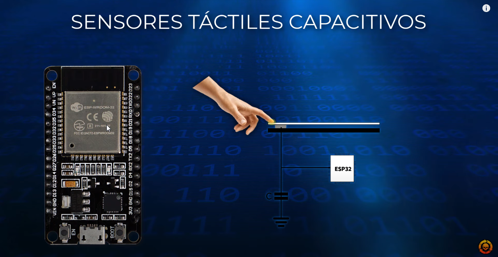

# SENSORES TÁCTILES ESP32 - DEVKIT V1

**Los sensores táctiles del esp32 nos permiten detectar cambios en la capacitancia cuando estos son tocados.
Estos pines se pueden integrar fácilmente en almohadillas capacitivas y reemplazar botones mecánicos.**

## Funciones Arduino IDE:

| Función | Descripción |
| ------------- | ------------- |
|touchRead(pin); | Obtiene la lectura de un sensor táctil.
|touchAttachInterrupt(pin, función, Umbral);| Permite adjuntar una interrupción a un sensor táctil.
|touchAttachInterruptArg(pin, función, Argumentos, Umbral);| Como la anterior pero esta nos permite pasar parámetros a la funcion de interrupción.
|touchDetachInterrupt(pin); | Desvincula una interrupción con un sensor táctil.
|touchInterruptSetThresholdDirection(esInferior);| Cambia la lógica de activación de las interrupciones.
|touchInterruptGetLastStatus(pin);| Devuelve verdadero si el sensor esta siendo tocada y falso en caso contrario.
|touchSleepWakeUpEnable(pin, Umbral);| Despierta al ESP32 del modo sueño profundo.
|touchSetCycles( Medida, Sueño);| Modifica la precisión en los ciclos de lectura.

Ver vídeo:
https://youtu.be/07b8nKLS_PM

