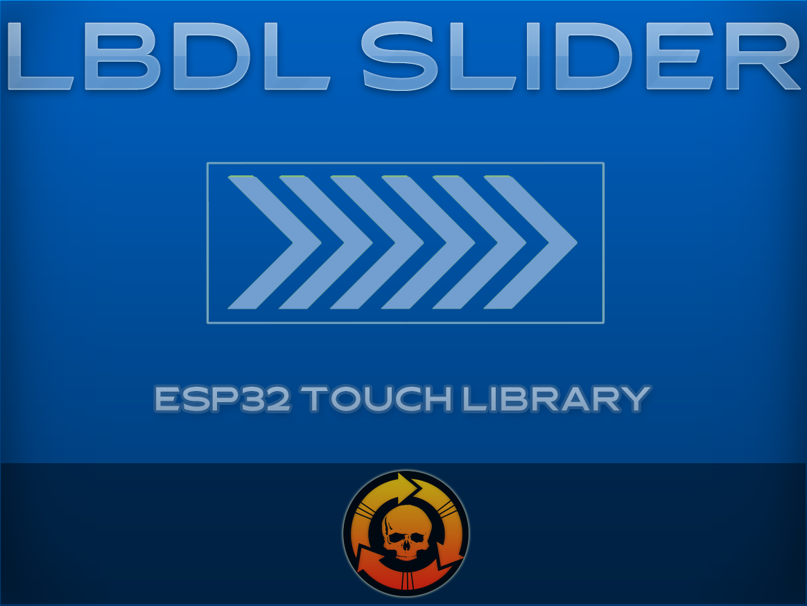

# LBDL Slider

Esta librería nos permite gestionar el funcionamiento de controladores deslizantes tactiles en ESP32.

| Función | Descripción |
| ------------- | ------------- |
| setup(int touch1, int touch2, int touch3)| Inicializa el slider con los sensores seleccionados.
detectDirection()| Monitoriza la dirección del deslizamiento del slider.
|getDirection()| Devuelve la dirección del deslizamiento del slider (LEFT/RIGHT).
|clearDirection()|Resetea la dirección del deslizamiento del slider.

